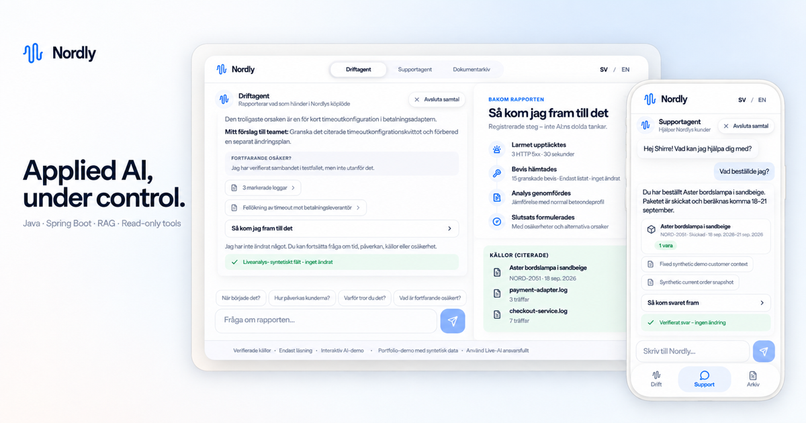
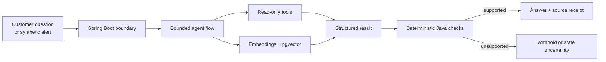

<p align="center">
  
</p>

# Nordly — Controlled Applied AI in Java

Nordly is a synthetic commerce environment that shows how I build useful AI
features inside a conventional software system. A customer-facing support agent
answers with order data and company policy. An internal operations agent
investigates incidents and reports what happened, what the evidence supports,
and what is still uncertain.

The model can interpret and propose. Java owns permissions, tool boundaries,
source access, validation, and the final release decision.

**[Try the live demo](https://nordly.sh1rre.se)** ·
**[Read the engineering decisions](docs/DECISIONS.md)** ·
**[Explore the documentation](docs/README.md)**

> Nordly, its customers, orders, documents, and incidents are fictional. The
> application is a portfolio and learning project, not a production commerce or
> incident-response system.

## What you can test

| Experience | What it demonstrates |
|---|---|
| **Support agent** | Natural multi-turn chat grounded in one synthetic customer's order, allowed read-only tools, and Nordly's company documents. Requests outside its authority are declined without exposing restricted content. |
| **Operations agent** | A synthetic alert wakes a fixed investigation flow. The agent reads bounded telemetry and runbooks, cites evidence, reports customer impact, and keeps uncertainty visible. |
| **Document archive** | The exact company sources available to retrieval are inspectable, including lifecycle and access rules. Source links open the passage used in an answer. |

Both agents are designed to feel conversational. The technical receipt stays
available on demand so a non-technical visitor can use the product first and a
technical reviewer can inspect how the answer was produced.

## System flow



### Three deliberate engineering choices

1. **RAG for governed knowledge; tools for live state.** Policies and runbooks
   are retrieved semantically from a versioned corpus. Orders, logs, metrics,
   and traces remain behind typed read-only functions.
2. **The model never grants itself authority.** A model may select an allowed
   action or draft a structured response, but application code binds identity,
   checks access, verifies cited evidence, and decides whether the result may be
   shown.
3. **Failure remains visible.** A malformed or unsupported live response is not
   silently replaced by a successful replay. Recorded replay is a separate,
   clearly labelled provider-free demo path.

## Technical design

- **Backend:** Java 21, Spring Boot, Maven
- **Frontend:** React 19, TypeScript, Vite, Motion
- **AI:** Google Gemini / Vertex AI provider seam, structured outputs, function
  calling, bounded sequential agent flow
- **Retrieval:** Gemini embeddings, PostgreSQL, pgvector, versioned corpora
- **Verification:** schema validation, citation membership, evidence support,
  access rules, deterministic scenario truth
- **Testing:** JUnit, Testcontainers, Vitest, recorded checksummed replays,
  opt-in provider smokes
- **Observability:** structured events, Micrometer metrics, model/tool counters,
  nullable token usage and cost estimates

The operations flow is an observable evidence chain, not a display of private
model reasoning. The UI replays registered backend events and exposes the
sources that were actually available to the model.

## Run locally

### Requirements

- Java 21
- Node.js 20.19 or newer
- Docker only for the pgvector/RAG profile

### Provider-free demo

Start the backend:

```bash
./mvnw spring-boot:run
```

In a second terminal, start the interface:

```bash
cd frontend
npm ci
npm run dev
```

Open [http://127.0.0.1:5173](http://127.0.0.1:5173). Recorded replay works
without a model key. The frontend proxies API requests to
`http://127.0.0.1:8080` by default.

### RAG and live AI

Start PostgreSQL/pgvector and explicitly import the versioned corpora:

```bash
docker compose up -d
./mvnw -q spring-boot:run -Dspring-boot.run.arguments=--import-runbooks
./mvnw -q spring-boot:run -Dspring-boot.run.arguments=--import-nordly-knowledge
```

Then enable the RAG profile and live provider deliberately:

```bash
SPRING_PROFILES_ACTIVE=rag \
INCIDENT_DETECTIVE_LIVE_AI_ENABLED=true \
INCIDENT_DETECTIVE_ADK_ENABLED=true \
./mvnw spring-boot:run
```

Developer API is the local default and uses an ignored Gemini key. Vertex AI
uses Application Default Credentials with `GOOGLE_GENAI_PROVIDER=vertex_ai`,
`GOOGLE_CLOUD_PROJECT`, and an optional `GOOGLE_CLOUD_LOCATION`. Every live
request still requires explicit server and request-level opt-in.

## Verification

```bash
# Backend unit and application tests
./mvnw test

# PostgreSQL and pgvector integration tests
./mvnw -Pdatabase-it verify

# Frontend behavior and production build
cd frontend
npm test
npm run build
```

Provider smokes and retrieval evaluations are opt-in so ordinary CI never
spends model credits. The published small historical retrieval set reached 5/5
development and 4/5 held-out Hit@4, with 3/3 no-match cases. The missed
held-out case is retained as a failure case; this is evidence from a small
synthetic corpus, not a general quality claim.

## Repository map

```text
frontend/                         React product experience and UI tests
src/main/java/                    Spring Boot application and bounded AI flows
src/main/resources/ai/            Prompts, schemas, and tool contracts
src/main/resources/knowledge/     Versioned Nordly company corpus and replays
src/main/resources/runbooks/      Versioned operations corpus
src/test/                         Behavioral, safety, and integration tests
docs/                             Architecture, decisions, system card, evidence
```

Start with the [documentation index](docs/README.md). For a deeper review, the
most useful files are:

- [Engineering decisions](docs/DECISIONS.md)
- [AI system card](docs/AI-SYSTEM-CARD.md)
- [Nordly company knowledge](docs/NORDLY-COMPANY-KNOWLEDGE.md)
- [Frontend/backend contract](docs/FRONTEND-API-HANDOFF.md)
- [Cloud logging](docs/CLOUD-LOGGING.md)
- [Latest dated private-cloud smoke report](docs/PRIVATE-VPC-VERTEX-CLOUD-SQL-SMOKE-2026-09-16.md)

## Scope and limitations

- All business and incident data is synthetic.
- Tools are read-only; the system does not deploy, roll back, refund, cancel,
  or otherwise mutate an external environment.
- Replay and live AI are separate modes and are labelled separately.
- Historical smoke and evaluation reports describe dated runs, not permanent
  production readiness.
- Authentication, distributed abuse protection, and multi-instance production
  operations are outside this portfolio demo's current scope.

The repository is public for portfolio review. It intentionally does not grant
an open-source license.
